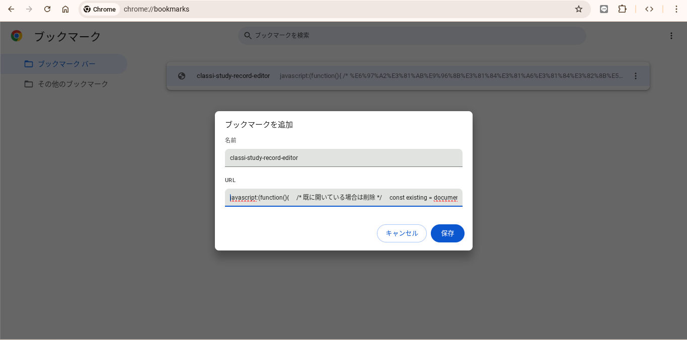
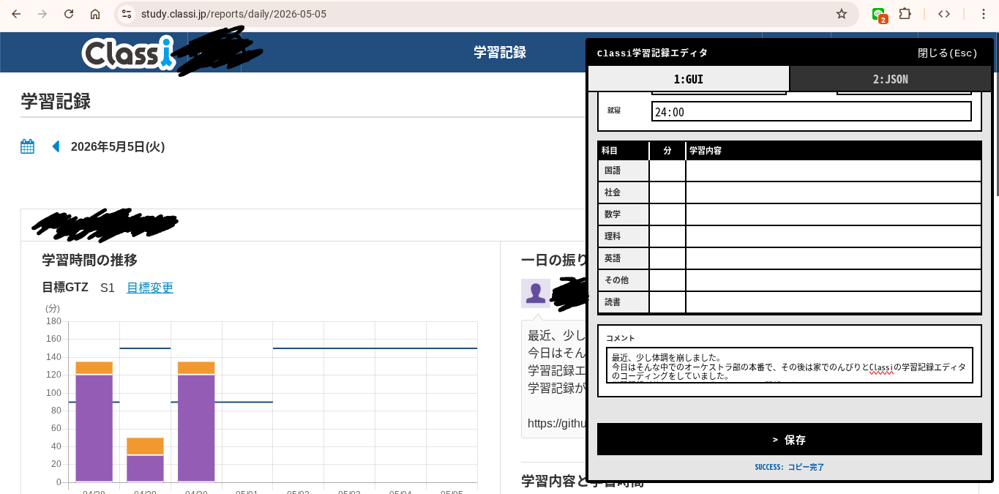

# classi-study-record-editor
Classiの学習記録を直感的に入力するエディタです。
# 概要
Classiの学習記録を使っていると、前日と同じような内容を打ち込んでいるのにいちいち最初から打ち込まないといけないということが発生します。これが少し鬱陶しかったので、表形式で編集できる自作エディタを作りました。

自称進学校の自称進学校による自称進学校のためのツールです。Classiと学習記録を強要された自称進学校の効率厨の皆さんにぜひとも使っていただきたいと思います。
# 使い方(JS版)
**学校による管理のため、一切実行ができない可能性があります。ご了承ください。**

ここに掲載されているJSのコードを以下の画像のようにブックマークに追加します
そして、先程のブックマークをclassiの学習記録のページから開くことで、入力した内容が反映されます。
[Classi](https://classi.jp)

# 注意書き
このツールによるいかなる損害も負いません。動作が不安定のため、データが消滅するおそれがあります。

[Classiの利用規約](https://id.classi.jp/notice)には一応目を通してあります。しかしながら、不正アクセスとみなされる可能性がないことを保証しかねます。

[直感的:主観です。](#classi-study-record-editor)

[画像:個人情報なので一部黒塗りしています。UIが異なる場合があります。](#使い方js版)