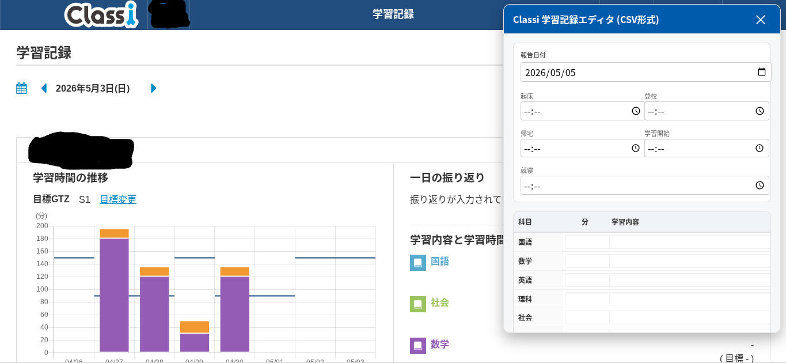

# classi-study-record-editor
Classiの学習記録を自動入力するエディタです。
# 概要
Classiの学習記録を使っていると、前日と同じような内容を打ち込んでいるのにいちいち最初から打ち込まないといけないということが発生します。これが少し鬱陶しかったので、表形式で編集できる自作エディタを作りました。Classiと学習記録を強要された自称進学校の効率厨の皆さんにぜひとも使っていただきたいと思います。
# 使い方(JS版)
ここに掲載されているJSのコードを以下の画像のようにブックマークに追加します
そして、先程のブックマークをclassiの学習記録のページから開くことで、入力した内容が反映されます。個人情報なので一部黒塗りしています。
# リンク
[Classi](https://classi.jp)
